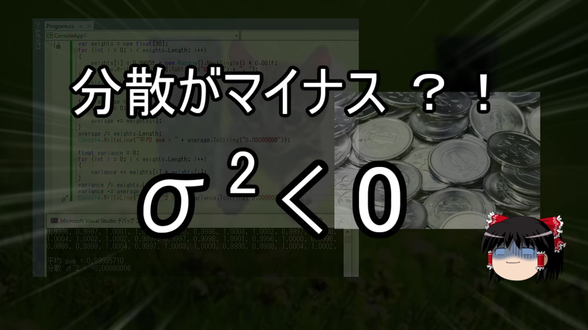

# 【ゆっくり解説】数値計算の常識【プログラミング】
動画 [【ゆっくり解説】数値計算の常識【プログラミング】](https://www.youtube.com/watch?v=cFohSD9m63Y) で解説しているコードです。

https://www.youtube.com/watch?v=cFohSD9m63Y

## 開発環境
- [Visual Studio 2022](https://visualstudio.microsoft.com/ja/downloads/)

